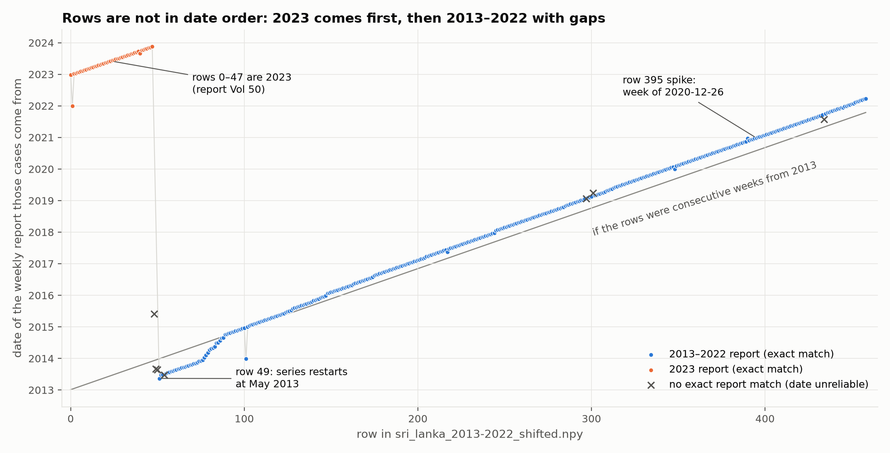
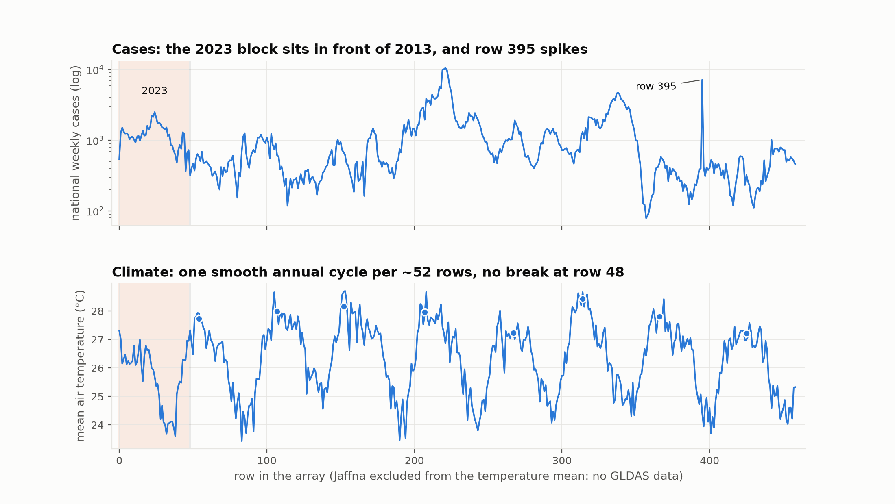
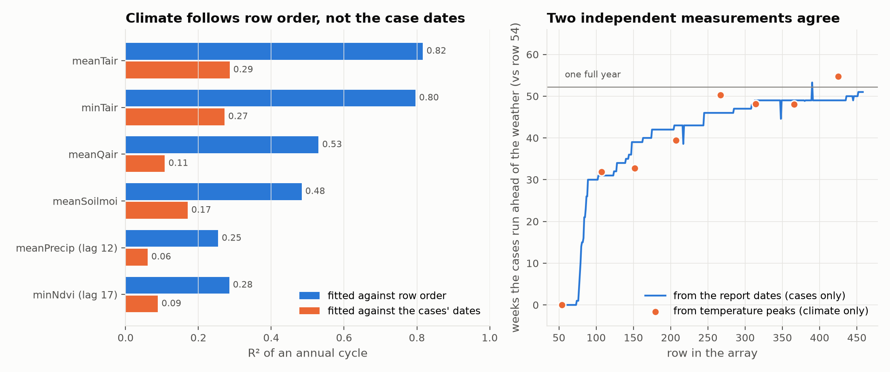
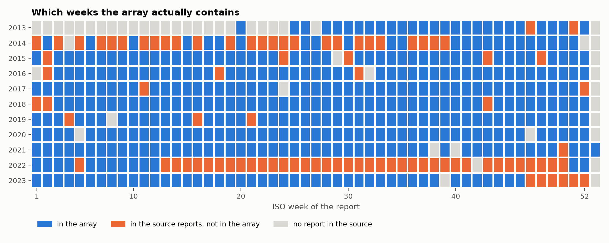
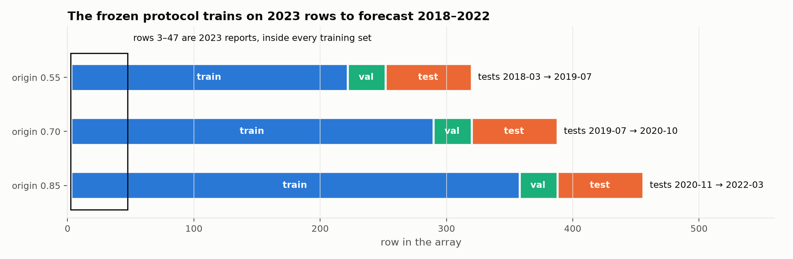
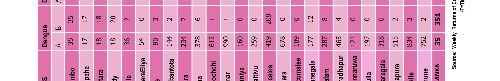

# Audit — the time axis of `sri_lanka_2013-2022_shifted.npy`

**Status:** diagnosed, and corrected case series built in `data/corrected/`. The
original array is unchanged. Re-running the benchmark on the corrected data is
in progress (see the last section).

`docs/DATA.md` describes the array as *"459 consecutive weeks spanning
2013–2022"*. The array itself has no date axis, so that description was never
checked. This audit checks it.

Reproduce with:

```bash
python analysis/_build/build_seir_inputs.py calendar --raw "datasets/output_Dengue Fever.csv"
python analysis/_build/audit_array_order.py --raw "datasets/output_Dengue Fever.csv"
```

Outputs: `analysis/results/array_audit/audit.json` and five figures.
`data/external/calendar_index.csv` is the table behind every chart.

---

## How rows were dated

Each row's 25-district case vector was matched against the Epidemiology Unit's
weekly-report dump. **452 of 459 rows reproduce a named report exactly.** Each
report's volume number gives its year: Volume N is year 1973 + N, which holds for
457 of 459 rows. The two exceptions are dates the dump itself parsed wrongly. The
authors' public `sri_lanka_2013-2022_vertical.csv` confirms array row 0 is their
row 315, with zero difference.

Everything below was then re-tested with checks that **don't reuse the matching**.

---

## Findings

### 1. The rows are not in date order — confirmed


- **Rows 0–47 are 2023** (report Volume 50). Row 49 onward runs from May 2013 to
  March 2022.
- Likely cause: in 2023 the report files were renamed to `en_…Vol_50…`, which
  sorts before the older `vol_40…` names.
- **Rows 444 and 445 are identical**: the same week stored twice.
- **7 rows (48, 49, 50, 54, 297, 301, 434) match no report exactly.** Their dates
  are nearest-report guesses and shouldn't be trusted.

### 2. Cases and climate follow different timelines — confirmed, and the most serious finding



The case column was reordered. **The climate columns were not.**

- An annual cycle fits temperature with **R² 0.82 in row order**, but only **0.29
  against the case dates**. Humidity, soil moisture, precipitation and NDVI all
  show the same pattern.
- Temperature runs smoothly through row 48 with no break. The temperature peak
  comes every **53 rows on average**, about one per year.
- **Two independent measurements of the drift agree to within 2.8 weeks on
  average.** One uses only the report dates; the other uses only where the
  temperature peaks fall. Both say the cases run steadily further ahead of the
  weather: about 31 weeks by row 107, and about 48–55 weeks from 2019 onward.

**What that means:** in most rows the model sees cases from one week next to
weather from a different week. By 2019–2021 that's about a year earlier. This may
explain why climate inputs made every model worse (EXP-024, the covariate sweep),
**but that hasn't been tested.**

**What this can't tell us:** the absolute offset. The drift is measured relative to
row 54, and the misalignment there is unknown. The 2023 block's climate dates are
also unknown.

### 3. Weeks are missing, and some were dropped during processing — confirmed


- **49 weekly reports exist in the source dump but aren't in the array.** These
  were lost in processing, not missing from the source.
- 2014 is about half missing. **2022 stops in March** even though the reports from
  April onward are in the source. Late 2023 is also absent.
- Other gaps have no report in the source at all.

### 4. Every training split contains 2023 — confirmed


Rows 3–47, the 2023 reports, sit inside the training set of all three folds of the
frozen protocol. The test periods are 2018-03 → 2019-07, 2019-07 → 2020-10 and
2020-11 → 2022-03, so **every model trained on data from after its test period.**

### 5. The week-395 spike is a formula error in the published report — confirmed


It comes from [WER Vol 48 No 02](https://www.epid.gov.lk/storage/post/pdfs/vol_48_no_02-english_1.pdf),
covering 26 Dec 2020 – 01 Jan 2021. That PDF's Dengue table has two rows: **A**,
cases this week, and **B**, cumulative for the year. The printed A row is broken:

- **15 of its 24 inner cells equal the sum of the two before them**: 18, 18, 36,
  54, 90, 144, 234, 378, 612, 990, … That's a formula dragged across a row.
- Its districts sum to 7,165, Kalmunai reads 752, and its national cell reads 35.
- Row B is consistent: its districts plus Kalmunai sum to **exactly 351**, its
  own national total.
- **No other report among the 552 shows the pattern in more than 3 cells.**

Because this is the first week of the year, cumulative equals weekly, so row B
*is* the correct weekly count. **The spike is not an administrative backlog.** It's
a spreadsheet error in one published table, and it can be corrected from the same
table. The paper's current wording ("administrative reporting backlog") needs
changing.

### 6. The climate channels are now absolutely dated — confirmed two ways
- **Exact match to raw satellite data.** The authors' repository includes one
  week of raw GLDAS files (1–8 Jan 2021). Replicating their aggregation (weekly
  per-cell means, cells inside each GADM district, dropping any cell with a
  missing variable) matches **array row 398** to within 0.069 K, with a
  district-pattern correlation of 0.998. The neighbouring rows are 4–12 times
  worse. The replication also gives Jaffna zero grid cells, which explains its
  all-zero columns.
- **Independent reanalysis.** Array temperature against ERA5 (below) gives
  **r = 0.947 at exactly zero shift**, falling to 0.875 at ±1 week. Against the
  dates the case rows claim, the same comparison gives r = 0.443.

So **climate row k is the week starting 2021-01-01 + 7(k − 398) days**: a
contiguous weekly series from **17 May 2013 to 25 Feb 2022**. The climate was in
order all along; the case column is what was displaced.

### 7. The "lagged" climate channels are shifted the wrong way — confirmed
`docs/DATA.md` says precipitation and canopy interception are lagged 12 weeks, so
row k should hold values from 12 weeks **earlier**. Against ERA5 they match best
at **12–13 weeks later** (precipitation r = 0.567 at +13 weeks, 0.549 at +12,
0.241 at +14; canopy r = 0.604 at +12). The zero-lag channels (temperature,
humidity, soil moisture) match best at zero, which confirms the test itself.

**NDVI shows the same reversal.** Against MODIS NDVI (below), the array's
`minNdvi` channel correlates **−0.146 at the documented shift** (17 weeks
earlier) and **+0.249 at 17 weeks later**. Every positive correlation sits on the
later side, on a broad plateau from about 9 to 18 weeks. The direction is clear;
the exact size isn't sharply identified, which is expected for a slow-moving
index measured by a different product (VIIRS minimum over cells vs a MODIS box
mean).

**What that means:** on the climate's own timeline, the lagged channels carry
rainfall, canopy interception and vegetation from roughly three to four months
in the future, not the past. The corrected covariates below don't reuse any of
them.

---

## Checks that were weak, and corrections

- **Official annual totals.** Array sums for 2017, 2018 and 2019 come to 85–90% of
  the published national totals. The weekly reports are provisional, so some
  shortfall is expected. The ratios between years favour the calendar index
  (log error 0.026) over reading the array as in order (0.063), but that's
  **supporting evidence, not proof**.
- **The splice isn't visible in the cases alone.** The case jump at row 47→48 sits
  at the 98.9th percentile, but a jump inside 2023 is nearly as large. The strong
  evidence for the splice is the report matching, not the case numbers.
- **Correction to `SEIR_DATA_SOURCES.md`.** It said ~135 calendar weeks were
  missing and listed 7 "duplicates". The first figure mixed together out-of-order
  steps, source gaps and dropped reports; the breakdown above replaces it. The 7
  were unmatched rows, and the one true duplicate is rows 444/445.

---

## Not yet measured

- **How much any of this changes existing results.** Persistence is measured
  (below). Model results are running on Kaggle.
- **The exact NDVI shift.** The direction is established (finding 7); the size
  is only bracketed, at 9–18 weeks.

## Decisions for the team

1. **The SEIR-GNN needs real, ordered time.** Build its input from the dated
   reports, not from the array order.
2. **The existing benchmark.** Re-running it on a corrected array invalidates
   every table in the paper. The alternative is to report the audit as a
   limitation. `CLAUDE.md` says re-deriving the array is its own task, so this
   needs a team decision.
3. **Climate inputs.** They can't be judged until they're aligned with the cases.
   Every "climate doesn't help" result so far was measured on misaligned rows.

---

## Correction (done) and re-run (in progress)

`analysis/_build/build_corrected_cases.py` builds two case-only series in
`data/corrected/`. The original array is left untouched.

| Dataset | Weeks | Span | What it isolates |
|---|---|---|---|
| `reordered` | 451 | the benchmark's own rows, in true order, duplicate removed | the effect of **ordering** alone |
| `rebuilt` | 559 | every source report, 2013-W26 → 2024-W10; the 7 weeks with no report stay missing (NaN) | the corrected dataset going forward |

Time is keyed by report volume and number, not the dump's parsed date. **All 451
`reordered` weeks match `rebuilt` exactly**, so the array's values are the
published values; only their order and coverage were wrong.

Found while building it:

- **A name-mapping bug in the first audit pass.** `Monaragala` and the truncated
  label `paha` weren't mapped, which dropped Moneragala from every report and
  Gampaha from 30. With the fix, the 452 exact matches still hold on all 25
  districts.
- **Kalmunai.** The source reports the Kalmunai health division separately. It
  lies inside Ampara, and the authors' config excludes it, so the benchmark's
  Ampara target is Ampara RDHS only. That definition is kept for comparability.
- **The national-total check.** Districts plus Kalmunai equal the Epidemiology
  Unit's own national total in **432 of 552 reports**. In the rest, the parsed
  national figure is typically a tenth of the district sum, which looks like a
  parsing loss in that one field.
- **The week-395 report is corrected in `rebuilt` only** (finding 5), using row B
  from the published PDF (`data/external/report_corrections.json`, which records
  both rows and the evidence). `reordered` keeps the original values, because
  it exists to isolate ordering.
- **Report numbers aren't exactly epidemiological weeks.** Vol 48 No 02 is "1st
  Week". The sequence is unbroken, so ordering is unaffected.

### The persistence floor moves

Same code, frozen protocol, artifact located by report, windows touching a missing
targets excluded:

| Dataset | RMSE (all windows) | RMSE (artifact-free) |
|---|---:|---:|
| `original` | 44.795 | **29.521** (reproduces the paper) |
| `reordered` | 48.265 | **31.089** |
| `rebuilt` | **36.016** | **36.016** (no artifact left to exclude) |

The test periods themselves change. In `reordered` the artifact moves from the
0.85 fold to the 0.70 fold. In `rebuilt` it's gone, and the last fold covers
2022–2024, including the large 2023 epidemic. **Model results on the corrected
data are pending** (Kaggle kernels `corrected-benchmark-*`, compared with
`compare_corrected.py`).

### Corrected covariates
`analysis/_build/build_corrected_covariates.py` builds covariates aligned **row
for row** with `rebuilt`:

| File | What | Source |
|---|---|---|
| `rebuilt_climate_era5.npy` (559, 25, 6) | temperature mean/min/max, precipitation, relative humidity, soil moisture | ERA5 via Open-Meteo, one interior point per district. Jaffna included. No lags applied. |
| `modis_ndvi_weekly_by_district.csv` | NDVI per district per rebuilt week | MOD13Q1 v061 (250 m, 16-day) via ORNL's public subset service, ±5 km box around each district's interior point; **as-of** — each week holds the latest composite already released before it began (16-day window + 16-day release delay), never interpolated |
| `rebuilt_population.npy` (559, 25) | persons per district per week | **previous year's official figure**: 2013–14 the 2012 Census count (DCS district reports), year Y ≥ 2015 the DCS mid-year estimate for Y−1 (`rebuilt_population_sources.csv`) |
| `data/external/district_census_2012.csv` | over-60 share (a ratio only) | 2012 Census at GN level via HDX (WFP/OCHA); projections dropped. Official district totals: `census_2012_dcs_district_totals.csv` |

Lags belong in the model, applied causally, not baked into the data.
`analysis/lib/corrected_data.py` enforces them (cases 1 week, climate 2, NDVI and
population already as-of) and `tests/test_no_future_leakage.py` checks it. Sources
and manual re-download steps: `docs/DATA_PROVENANCE.md`.
